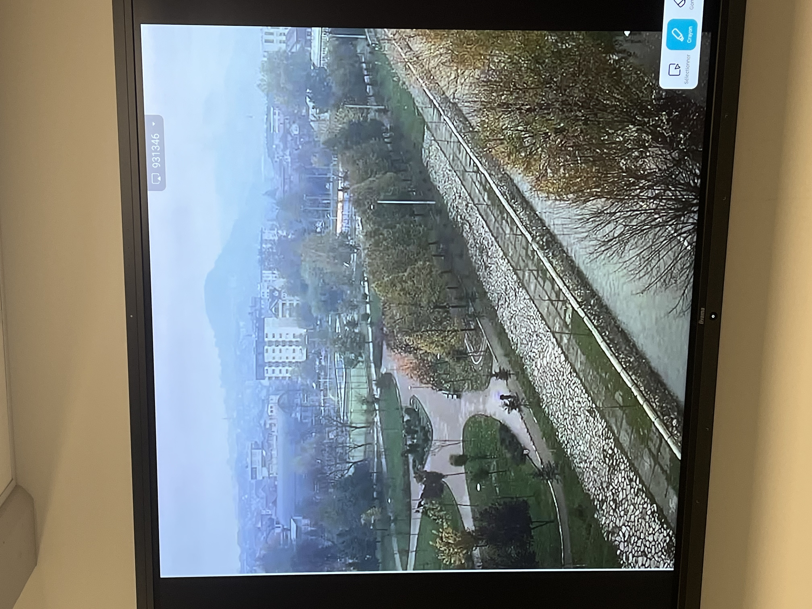

# TP 1 Retrouver l'image (Novi Pazar)

**Objectif :** Localiser précisément une photo et identifier la caméra de surveillance vulnérable (IP) ayant capturé l'image.

### Outils utilisés

- **Google Lens** (Recherche inversée)
- **Google Maps** (Repérage topographique)
- **Shodan** (Moteur de recherche de périphériques connectés)
- **Insecam** (Répertoire de caméras IP publiques)

### Étape 1 : Analyse de l'image (OSINT)

1. **Recherche inversée :** Upload de l'image source `IMG_2697.jpeg` dans Google Lens.
2. **Résultats :** Identification de la ville de **Novi Pazar** (Serbie) via des articles de presse ou vidéos similaires.

### Étape 2 : Géolocalisation précise (GEOINT)

1. **Points de repère :** Identification sur la photo d'un parc, d'une montagne en arrière-plan et d'un grillage spécifique.
2. **Triangulation :** En parcourant Novi Pazar sur Google Maps, l'emplacement exact est identifié à l'adresse : **Kej 37. sandžačke divizije 2, Novi Pazar 36300, Serbie**.
3. **Hypothèse de la source :** L'angle de vue en plongée suggère une caméra fixée sur le bâtiment en face, identifié comme l'**Hôtel Vrbak**.

### Étape 3 : Recherche de la caméra (Cyber)

1. **Insecam & Shodan :**
    - Utilisation de **Shodan** pour scanner les IPs géolocalisées à Novi Pazar ou filtrer par type de device (Webcam/CCTV).
    - Utilisation de **Insecam** pour visualiser les flux en direct des caméras répertoriées dans cette ville.
2. **Identification :** Recherche d'une vue correspondant aux repères visuels (le parc, le grillage).
3. **Résultat :** La caméra est trouvée sur Insecam (Source 8).
    - **Adresse IP :** `http://109.233.191.130:8080`.
