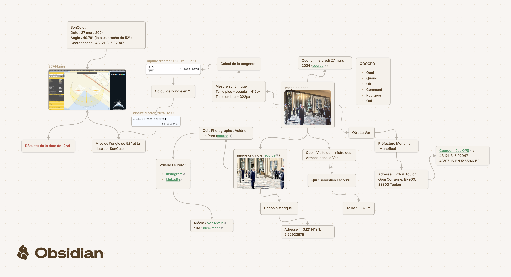

# TP 2 Chronolocalisation Avancée (Sébastien Lecornu)

Ce TP a été réalisé sur **Obsidian** en utilisant le mode "Canvas". Bien que l'utilisation d'Obsidian soit **optionnelle**, elle est fortement recommandée pour organiser vos enquêtes OSINT complexes, car elle permet de relier visuellement les preuves entre elles comme sur un tableau d'enquêteur.

**Objectif Final :** Déterminer l'heure exacte de la photo à la minute près en partant d'une simple image de presse.

## Phase 1 : La méthode QQOCPQ (Analyse contextuelle)

### Étape 1 : L'Image de base

  
- Importez l'image originale dans votre dossier de travail.
- **Action :** Observez la scène. On y voit des officiels, des militaires, une cour pavée et un bâtiment classique jaune/ocre.

### Étape 2 : Quoi ? (L'événement)

- **Recherche :** Faites une recherche inversée ou par mots-clés (ex: "Ministre Armées visite sud").
- **Résultat :** Il s'agit de la "Visite du ministre des Armées dans le Var".

### Étape 3 : Qui ? (Le Sujet)

- **Identification :** L'homme au centre est **Sébastien Lecornu**, ministre des Armées.
- **Donnée biométrique :** Cherchez sa taille sur internet pour les futurs calculs.
    - _Info trouvée :_ Taille environ **1,78 m**.

### Étape 4 : Quand ? (La Date)

- **Source :** Trouvez l'article de presse associé à l'image (via _Nice-Matin_ ou _Var-Matin_).
- **Résultat :** La visite a eu lieu le **mercredi 27 mars 2024**.

### Étape 5 : Où ? (Le Lieu précis)

- **Macrolocalisation :** Le département du **Var**.
- **Microlocalisation :** D'après l'architecture et l'événement, c'est la **Préfecture Maritime** (aussi appelée "Manofica").
- **Adresse exacte :** BCRM Toulon, Quai Consigne, BP900, 83800 Toulon.

### Étape 6 : Coordonnées GPS

- **Outil :** Google Maps / Google Earth.
- **Action :** Pointez exactement la cour de la Préfecture Maritime.
- **Résultat :** `43.12113, 5.92947` (ou 43°07'16.1"N 5°55'46.1"E).
- _Note :_ Repérez le "Canon historique" à proximité (`43.12114N, 5.92932E`) pour confirmer l'endroit exact de la prise de vue.

---

## Phase 2 : Vérification de la Source

### Étape 7 : Identification du Photographe

- **Source :** Les crédits de la photo dans l'article de _Nice-Matin_11.
- **Résultat :** La photographe est **Valérie Le Parc**.

### Étape 8 : Profilage (Optionnel mais rigoureux)

- Vérifiez que la photographe était bien sur place pour valider l'authenticité.
- **Réseaux :** Instagram (`@leparcvalerie`), LinkedIn.
- **Média :** Elle travaille pour le groupe _Nice-Matin_ / _Var-Matin_14.

---

## Phase 3 : Analyse Technique et Mathématique

### Étape 9 : Mesures Pixels (Pixel Analysis)

Sur l'image originale, sans tenir compte de l'échelle réelle, mesurez la hauteur du sujet et la longueur de son ombre projetée au sol.

- **Outil :** Un logiciel de retouche (Photoshop, GIMP) ou un outil de capture d'écran avec mesure.
- **Mesure 1 (Hauteur) :** Taille pied - épaule = **415 px**.
- **Mesure 2 (Ombre) :** Taille de l'ombre au sol = **322 px**.

### Étape 10 : Calcul de la Tangente

Pour trouver l'angle du soleil, on utilise la formule de la tangente : $\tan(\text{angle}) = \frac{\text{Opposé}}{\text{Adjacent}}$.

- **Calcul :** $\frac{415 \text{ (Hauteur)}}{322 \text{ (Ombre)}}$
- **Résultat intermédiaire :** $1.2888$.

### Étape 11 : Conversion en Degrés (Arctan)

Il faut convertir ce ratio en degrés pour obtenir l'élévation du soleil.

- **Calcul :** $\arctan(1.2888)$ (aussi noté $\tan^{-1}$).
- **Résultat :** Environ **52°** (plus précisément 52,17°).

---

## Phase 4 : Chronolocalisation Finale (SunCalc)

### Étape 12 : Configuration de SunCalc

Allez sur le site [SunCalc.org](https://www.suncalc.org/) .

1. **Date :** Entrez le `27 mars 2024`.
2. **Lieu :** Entrez les coordonnées trouvées à l'étape 6 : `43.12113, 5.92947`.

### Étape 13 : Recherche de l'angle

- Regardez la courbe d'altitude du soleil (la courbe orange/jaune).
- Cherchez à quelle heure le soleil atteint une altitude de **52°**.
- _Note du schéma :_ Le pic le plus proche ce jour-là à Toulon était de **49.79°** (ce qui est très proche de votre calcul approximatif de 52°, validant le moment où le soleil est au plus haut ou presque).

### Étape 14 : Le Résultat Final

- En alignant l'azimut (direction de l'ombre) et l'altitude sur SunCalc :
- **Heure trouvée :** **12h41**